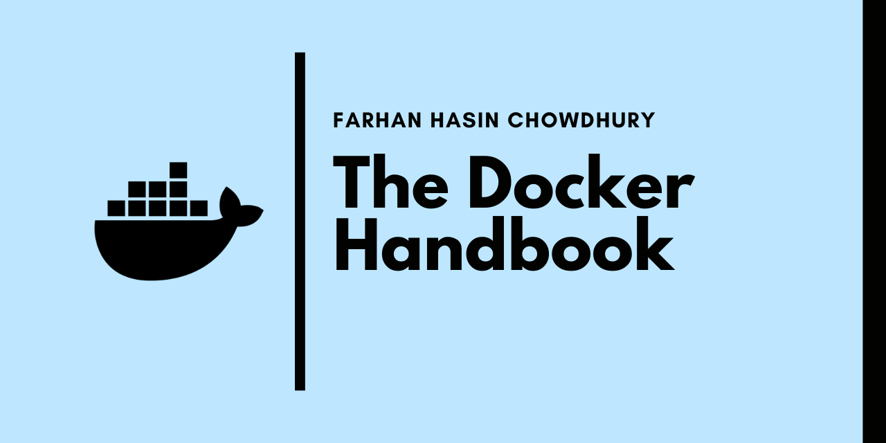

# Docker Handbook Projects

| :bell: NOTIFICATION |
|:--------------------|
| This branch contains the uncontainzerized versions of the projects. If you want the containerized ones, please check the [containerized](https://github.com/fhsinchy/docker-handbook-projects/tree/containerized/) branch. |

This repository holds the code for my [__Docker Handbook__](https://www.freecodecamp.org/news/the-docker-handbook/) article on [__freeCodecamp__](https://freecodecamp.org). In the article the readers work through __six__ projects with increasing complexity. These projects are as follows:

- custom-node - A custom node image based on the official [ubuntu](https://hub.docker.com/_/ubuntu/) image.
- custom-bash - A custom bash image based on the official [alpine](https://hub.docker.com/_/alpine/) image.
- express-api - A single container Express API.
- vite-counter - A single container Vue application.
- notes-api - A multi container Express API.
- fullstack-notes-application - A full-stack CRUD application with [nginx](https://hub.docker.com/_/nginx/) as a reverse proxy.

## Prerequisites

- Familiarity with the Linux Terminal.
- Familiarity with JavaScript (some of the later projects use JavaScript).

It's fine if you haven't worked with JavaScript that much. Having a basic knowledge of executing scripts with `npm` will suffice.
